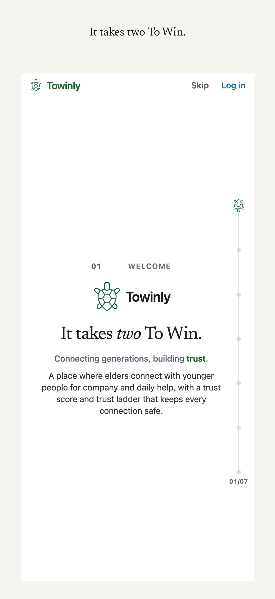
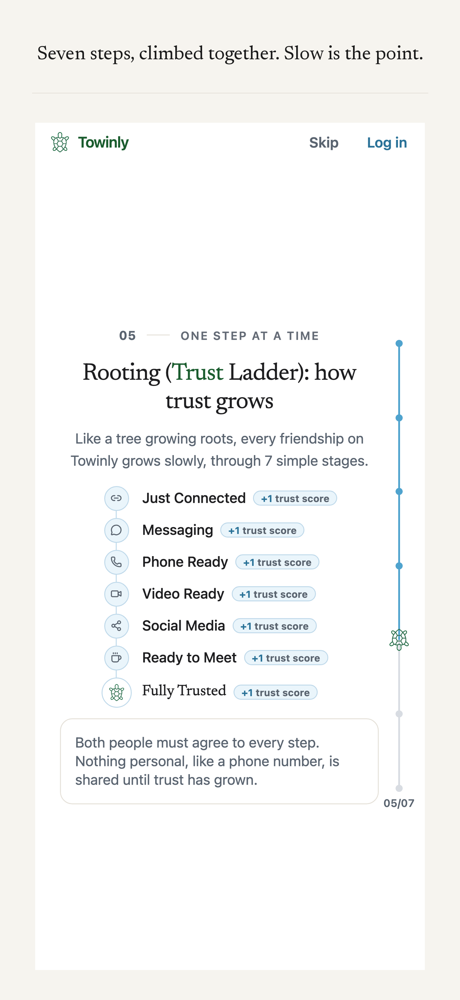
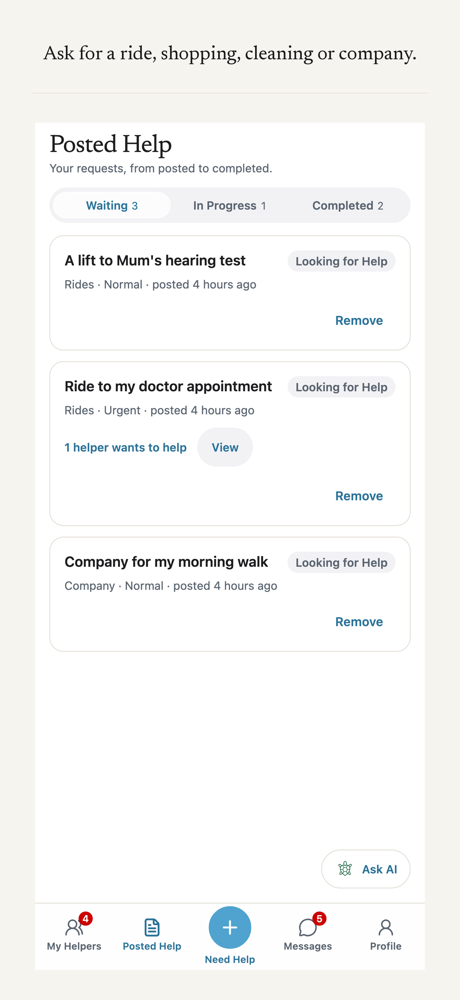
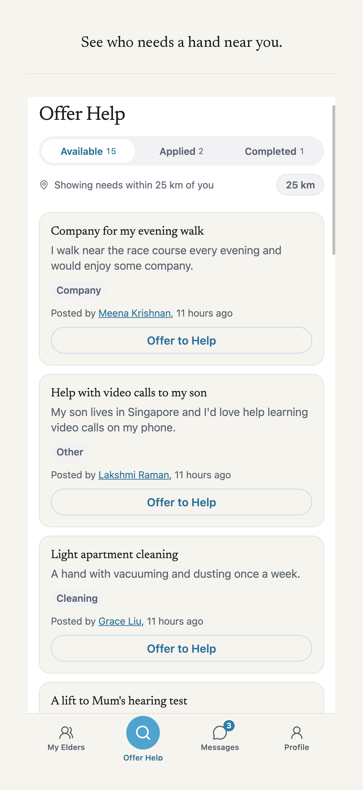
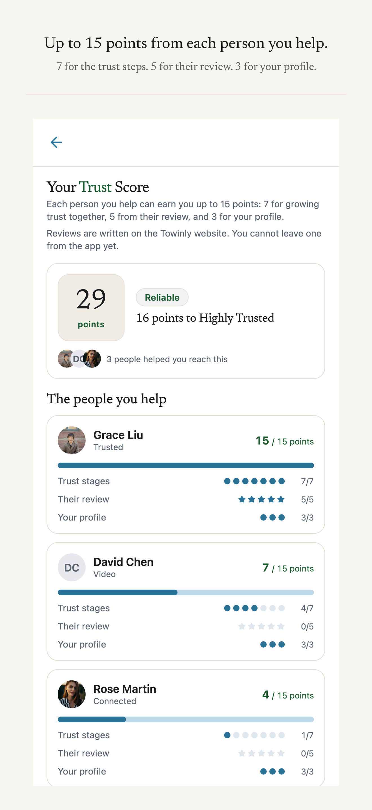
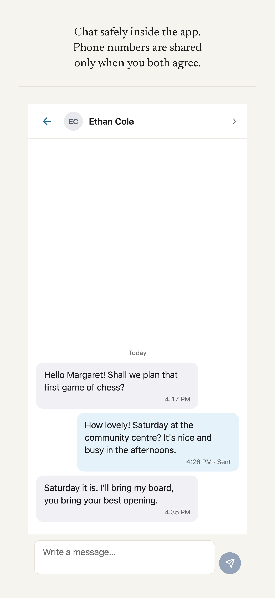
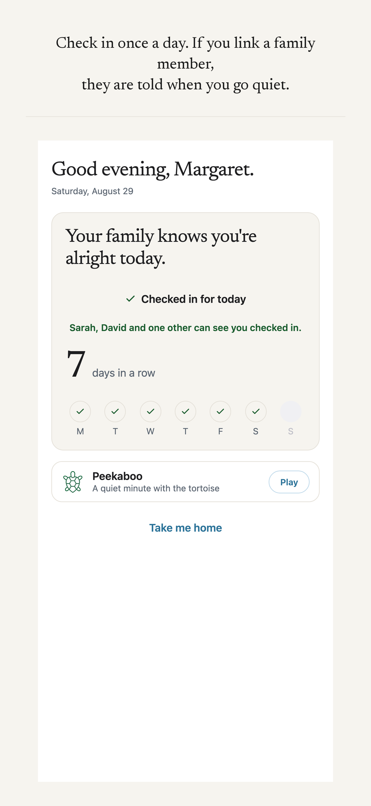
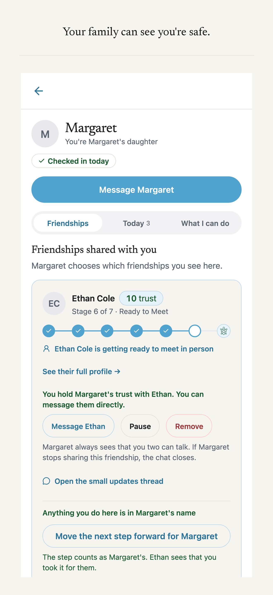

# Towinly

**It takes two To Win.**

Towinly connects elders with helpers who live nearby. Help is easy to find. Trust takes time. Every friendship climbs a seven-stage Trust Ladder, both people agree to each step, and family can watch over it all.

This repo is the mobile app: React Native + Expo, built for the iOS App Store and Google Play. It talks to the same Spring Boot backend as the Towinly website.

## Screens

<table>
  <tr>
    <td></td>
    <td></td>
    <td></td>
    <td></td>
  </tr>
  <tr>
    <td></td>
    <td></td>
    <td></td>
    <td></td>
  </tr>
</table>

## What it does

- Elders post the help they need. Helpers nearby see it and offer.
- Every friendship climbs seven trust stages, from Just Connected to Fully Trusted. Both people agree to each step, and neither shares anything personal, like a phone number, until trust has grown.
- A helper's Trust Score grows up to 15 points per person they help: 7 for the trust stages, 5 from that person's review, 3 for a complete profile.
- One tap checks an elder in for the day. Family sees it.
- An elder invites family and chooses which friendships they see. A family member can move a trust step in the elder's name, and the step says so.
- Chat lives inside the app and opens as one of the trust stages.

## Stack

- React Native with Expo Router. Expo SDK is locked at 54: read `AGENTS.md` before touching dependencies.
- The Spring Boot + Postgres backend from the Towinly website, reused unchanged. The app is one more API client.
- Named API functions in `src/api` over an axios client with a JWT bearer. Screens call those functions and never fetch on their own.
- Jest (`jest-expo`), 175 test suites: `npm test`.
- EAS for store builds. iOS ships to TestFlight.

## Run it

1. Backend (Postgres on :5432):

   ```bash
   cd <towinly-website-repo>/backend
   set -a && source ../.env && set +a   # JWT_SECRET etc.
   ./mvnw spring-boot:run               # serves :8080
   ```

2. App:

   ```bash
   npm install
   npx expo start
   ```

3. Phone: install Expo Go (SDK 54), then open `exp://<your-mac-lan-ip>:8081` in Safari. Find the IP with `ipconfig getifaddr en0`. Phone and Mac must share a network, and a VPN on the Mac can block LAN traffic.

Demo logins (they bypass the login rate limiter): elder `elder` / `12345678`, helper `helper` / `123456789`.

## Layout

- `app/`: expo-router screens. The `(auth)` stack, the `(tabs)` shell with per-role tabs (home, action, messages, dashboard, my elders, posted help, profile), and pushed screens (chat, trust, friends, family, pass on, streaks, legal).
- `src/theme`: design tokens (light and night; night is opt-in only) and ThemeContext.
- `src/api`: the named API functions and the axios client.
- `src/context`: Auth (JWT in SecureStore) and Toast.
- `src/components`: the UI kit (`ui/`), home feed cards (`home/`), the assistant.
- `src/lib`: pure logic (jwt, needs, roles, streaks, password), unit tested.
- `__tests__`: jest-expo suites.

## Hard rules

- Expo SDK stays at 54. The reference iPhone runs an Expo Go that supports SDK 54 only.
- Theme tokens (`src/theme/tokens.js`) are a locked port of the website palette. Leave them alone.
- The login body field is named `identifier`. Bad logins trip a 15-minute per-IP 429, so test with the demo logins.
- Never push to a remote without the owner's approval.
